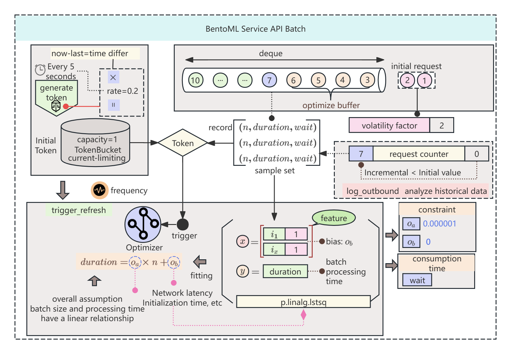

# BentoML Core Architecture
Welcome to the **BentoML Core Architecture Analysis**! This project aims to dissect and analyze the **BentoML** framework from a low-level perspective, focusing on its core mechanisms and implementation details rather than simply listing its features. By understanding the engineering principles and architecture behind BentoML, developers can more effectively use it to build, package, and deploy machine learning models.  

## Breakdown of BentoML Core Design  

Below is an analysis of the key mechanisms and modules within BentoML:  

### 1. Dependency Injection Mechanism (`simple_di`)  
- BentoML utilizes the lightweight dependency injection framework `simple_di` to manage dependencies between components. This mechanism ensures modularity and testability by explicitly declaring and dynamically injecting dependencies.  
- **Advantages**:  
  - Modular design improves code maintainability and scalability.  
  - Simplifies unit testing by allowing easy replacement of dependencies for different environments.  

### 2. Adaptive Batching  
- BentoML provides an adaptive batching mechanism to aggregate multiple prediction requests and process them in a single batch, improving concurrency and performance.  

- **Key Features**:  
  - **Dynamic Adjustment**: Dynamically adjusts batch size and latency based on traffic, balancing throughput and latency.  

### 3. RPC Communication Mechanism  
- BentoML employs an efficient RPC (Remote Procedure Call) mechanism to manage communication between services in distributed deployments.  
- **Features**:  
  - Supports both gRPC and HTTP protocols to accommodate various deployment scenarios.  
  - gRPC offers efficient binary serialization, ideal for high-frequency interactions, while HTTP is easier to integrate with existing systems.  

### 4. Multi-Worker Load Mechanism  
- BentoML supports a multi-worker mode to improve the concurrency capabilities of the API server by distributing requests across multiple workers.  
- **Core Mechanism**:  
  - The API server delegates incoming requests to different worker processes, preventing single-thread bottlenecks.  
  - Workers leverage shared memory or task queue mechanisms to ensure efficient resource allocation.  

### 5. Task Queue and Asynchronous Processing Mechanism  
- BentoML includes a task queue mechanism to decouple real-time requests from long-running tasks, such as large-scale batch predictions or complex preprocessing operations.  
- **Core Features**:  
  - **Asynchronous Execution**: Background tasks execute independently, ensuring real-time requests are not delayed.  

---  
## BentoML Architecture Diagram

To help visualize the architecture, here's a high-level diagram that outlines the main components of BentoML:
.......
